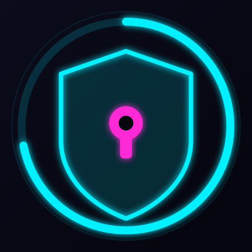

<h1 align="center">
  
  <br/>
  AVA
</h1>

<p align="center">
  <b>A</b>nother<b>V</b>apor<b>A</b>uth —— 用 <b>Flutter</b> 打造的现代化、轻量、跨平台 Steam 验证器。<br/>
  <sup>社区项目 —— 与 Steam / Valve 无任何关联。</sup>
</p>

<p align="center">
  单一代码库覆盖 <b>Windows · macOS · Linux · Android</b>（iOS 已规划）。
</p>

<p align="center">
  <a href="README.md">English</a> · <b>简体中文</b>
</p>

---

> **安全提示：** 在电脑上做二次验证会削弱 2FA 的意义 —— 设备一旦被入侵，令牌也随之暴露。
> 能用 Steam 官方手机 App 就尽量用。务必备份你的 `maFiles` 和撤销码（revocation code）。
> 使用风险自负。

## 功能亮点

- **maFile 兼容** —— 读写旧版 `.maFile` 格式（PBKDF2 50k/SHA1 + AES-256-CBC），老账户零成本迁移。
- Steam Guard 验证码 + 实时倒计时环，一键复制。
- 交易 / 市场**确认**，支持批量接受/拒绝（原生 JSON 渲染，不用内嵌 WebView）。
- 登录（密码 + **扫码**）、会话刷新、添加验证器、扫码批准。
- **双主题** —— 霓虹（Neon）与 像素（Pixel），设置内可切换。
- **多语言**（English + 简体/繁體中文），更多语言规划中。
- 完全**离线**：字体与资源全部打包，运行时不下载任何内容。

## 目录结构

```
app/      Flutter 应用（详见 app/README.md）
docs/     设计文档（docs/superpowers/specs/）
```

原 .NET WinForms 实现保留在 **`legacy`** 分支。

## 构建

需要 Flutter SDK（3.44.x）。详见 `app/README.md`。

```sh
cd app
flutter pub get
flutter test                       # analyze + 34 项测试
flutter run -d linux               # 或 windows / macos
flutter build apk --release --split-per-abi
```

每推送一个 `v*` 标签，GitHub Actions 会自动构建发布（Android APK + Linux + Windows），
见 `.github/workflows/release.yml`。

## 字体

所有字体均**打包进构建**（运行时不下载），在 `app/pubspec.yaml` 中声明；
详见 `app/assets/fonts/README.md`。

| 字体 | 主题 | 用途 | 来源 / 许可 |
|---|---|---|---|
| [Chakra Petch](https://fonts.google.com/specimen/Chakra+Petch) | 霓虹 | 标题 | OFL 1.1 |
| [JetBrains Mono](https://github.com/JetBrains/JetBrainsMono) | 霓虹 | 验证码 | OFL 1.1 |
| [Noto Sans SC](https://fonts.google.com/noto/specimen/Noto+Sans+SC) | 霓虹 | 中文（CJK）回退 | OFL 1.1 |
| [Fusion Pixel](https://github.com/TakWolf/fusion-pixel-font) | 像素 | 标题 + 验证码（拉丁 + 完整 CJK 含简/繁、假名、谚文） | OFL 1.1 |

像素主题使用**完整** Fusion Pixel 字体，实现完整 CJK 覆盖（含昵称中的生僻字）。
Noto Sans SC 子集化到 CJK 汉字区块（简体 + 繁体）。拉丁字体覆盖 ASCII。

## 致谢

原 Steam Desktop Authenticator 由 Jessecar96 及贡献者开发。Steam 认证协议参考：
[SteamAuth](https://github.com/geel9/SteamAuth)、
[node-steam-session](https://github.com/DoctorMcKay/node-steam-session)。

## 许可

见 [LICENSE](LICENSE)。打包字体各自保留其 OFL 1.1 许可。
